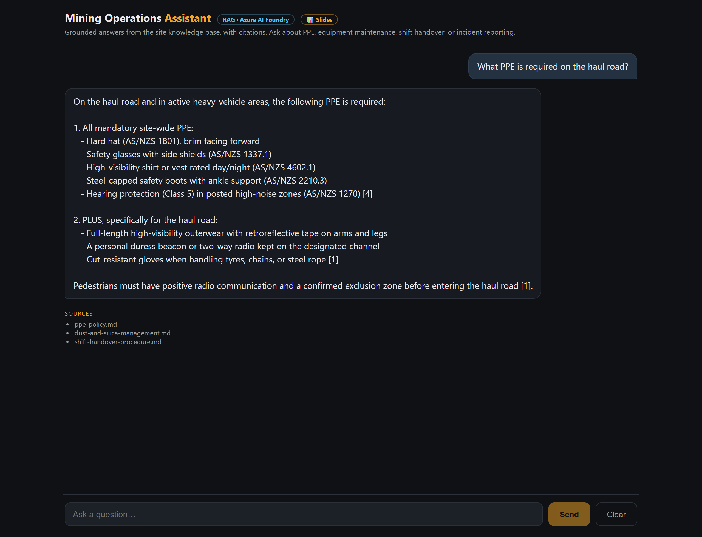

# az-ai-learning

Hands-on examples for building AI applications on Azure with .NET.

## 🔴 Live demo

**[rag-foundry-web-6.azurewebsites.net](https://rag-foundry-web-6.azurewebsites.net/)** — a streaming RAG chat assistant grounded in a synthetic mining-operations knowledge base. Ask it about site safety, equipment, or shift procedures and watch it answer with citations — or decline when the answer isn't in the corpus.

> Slide deck: **[/slides.html](https://rag-foundry-web-6.azurewebsites.net/slides.html)**

## Projects

### [`rag-foundry-demo/`](./rag-foundry-demo) — RAG on Azure AI Foundry

A self-contained .NET demo of **Retrieval-Augmented Generation**: ingest documents into a vector index, then answer questions **grounded in those documents** with citations.

- **Console app** — shows the RAG mechanics explicitly (chunk → embed → hybrid + semantic search → grounded prompt → answer).
- **Blazor Server web UI** — a browser chat over the same retrieval logic, with token-by-token streaming (this is what's deployed at the live link above).
- Keyless `DefaultAzureCredential` auth by default; provisioning, teardown, and re-enable scripts included.

See the [project README](./rag-foundry-demo/README.md) to run it locally or provision your own Azure resources.

## License

MIT — see [`LICENSE`](./LICENSE).
